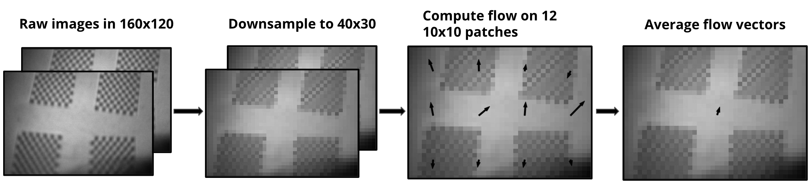

Optical Flow was perfomed using the Lucas-Kanade method. Typically, Lucas-Kanade is used for feature tracking by assuming motion in the local region around a feature is the same. To estimate flow, we assume that all motion in the frame is due to motion by the robot, i.e. all motion in the frame is in the same direction.

Rather than computing LK optical flow on the entire frame, the TinySense reduces computation by selecting 10 equally spaced patches and averaging their flow vectors (displayed in the video as the center arrow), achieving an estimated power consumption of 5.5 mW. The below video compares TinySense optical flow with a gyroscope, which under pure rotation will produce the same measurement. Note that due to difficulties storing captures at high data rates, this video contains flickering artifacts that were not present during the experiments.

    <iframe style="position: absolute; width: 100%; height: 100%; top: 0; left: 0;" src="https://www.youtube.com/embed/yuNV8dXP7nA?si=MnZ9sLN-hsS9RQo0" title="YouTube video player" frameborder="0" allow="accelerometer; autoplay; clipboard-write; encrypted-media; gyroscope; picture-in-picture; web-share" referrerpolicy="strict-origin-when-cross-origin" allowfullscreen></iframe>

